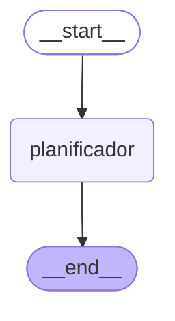
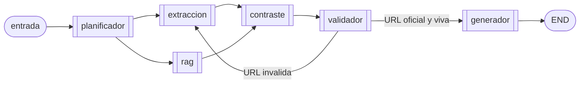

# Arquitectura - Sprint 1

Documento de entrega del **Sprint 1** del Agente de Transparencia Electoral
(ATE). Describe la topologia del grafo LangGraph, el estado compartido, el
agente planificador, los stubs de tools, y mapea cada criterio de
aceptacion del sprint a la evidencia concreta en el codigo.

**Referencias cruzadas**

| Recurso | Archivo |
| :-- | :-- |
| Especificacion del sprint | `sprintRecomendaciones.md` § "SPRINT 1" |
| Vision y restricciones eticas | `README.md` |
| Guia paso a paso de ejecucion | `docs/guia_ejecucion.md` |
| Grafo base — Mermaid autogenerado | `docs/grafo_sprint1.mmd` |
| Grafo base — PNG | `docs/grafo_sprint1.png` |
| Script que regenera los artefactos | `scripts/generar_grafo.py` |

---

## 1. Alcance

**Ejecutable en Sprint 1**

- Grafo base LangGraph con un nodo activo (`planificador`).
- Agente planificador con tres rutas de clasificacion (determinista,
  Anthropic, Ollama) y fallback explicito con traza.
- 5 tools stub con esquema de salida estable, registradas en un registro
  central (`ToolSpec`).
- CLI `python -m ate "<pregunta>"` que imprime el plan como JSON.
- Suite pytest con **44 casos**, sin dependencia de red ni API keys.
- Script de generacion de artefactos visuales del grafo.

**Declarado pero no implementado** (hooks comentados para sprints 2-5)

- Agente de extraccion — sprint 2.
- Agente RAG sobre planes de gobierno — sprint 3.
- Agente de contraste — sprint 4.
- Agente validador de URLs — sprint 4.
- Agente generador con citacion obligatoria — sprint 5.
- Interfaz Streamlit / FastAPI — sprint 5.

Ningun stub toca la red ni simula hechos electorales. La **arquitectura
queda completa como topologia**; los sprints siguientes solo agregan
cuerpo a nodos ya declarados.

---

## 2. Topologia del grafo

### 2.1 Grafo actual (Sprint 1)

Extraido directamente del grafo compilado via
`grafo.get_graph().draw_mermaid()` (ver `scripts/generar_grafo.py`). Esto
garantiza que el diagrama refleja lo que **realmente** corre, no una
reconstruccion manual.



Render PNG equivalente: `docs/grafo_sprint1.png`.

### 2.2 Grafo objetivo (sprints 2-5)

Los nodos y aristas siguientes estan pre-declarados como comentarios en
`src/ate/graph/builder.py`. Esta vista es la topologia final hacia la que
crece el sistema.



El arco `validador -> extraccion` es el ciclo que justifica el uso de
LangGraph (y no un `RunnableSequence` lineal): cuando el validador
detecta una URL no oficial o inalcanzable devuelve control al extractor
en vez de emitir una respuesta sin fuente verificada.

---

## 3. Estado compartido

`EstadoGrafo` es un `TypedDict` declarado en `src/ate/schemas/state.py`.
Es el unico canal de comunicacion entre nodos — no hay variables
globales, singletons ni contextos ocultos.

```python
class EstadoGrafo(TypedDict, total=False):
    pregunta: str
    plan: Optional[PlanEjecucion]

    # Campos de sprints futuros - comentados a proposito:
    # contexto_extraido: dict        # sprint 2
    # contexto_rag: dict             # sprint 3
    # contraste: dict                # sprint 4
    # validacion: dict               # sprint 4
    # respuesta_final: str           # sprint 5
```

**Por que `TypedDict` y no `BaseModel` para el estado.** LangGraph fusiona
los dicts parciales que devuelve cada nodo dentro del estado global
(`{"plan": ...}` se mergea, no reemplaza). TypedDict encaja naturalmente
con esa semantica. Los objetos **dentro** del estado (como
`PlanEjecucion`) si son Pydantic — ahi la validacion estricta si aporta.

---

## 4. Agente planificador

### 4.1 Responsabilidades

1. Leer `pregunta: str` del estado.
2. Detectar la intencion con un razonamiento trazable.
3. Elegir la lista ordenada de tools aplicables (via
   `tools_para(intencion)`).
4. Devolver `{"plan": PlanEjecucion(...)}` al estado del grafo.

### 4.2 Rutas de clasificacion

Despacho segun la variable `ATE_LLM_PROVIDER`:

| Provider | Como clasifica | Requisitos | Uso tipico |
| :-- | :-- | :-- | :-- |
| `none` *(default)* | Palabras clave normalizadas NFD (sin tildes, minusculas) | ninguno | CI y pruebas locales |
| `anthropic` | `ChatAnthropic.with_structured_output(_Clasificacion)` | `ANTHROPIC_API_KEY` | produccion nube |
| `ollama` | `POST /api/generate` con `format="json"` y `think=false` | `ollama serve` + modelo descargado | desarrollo local / clase |
| `openai` | placeholder; despacho cae a error | — | no implementado en Sprint 1 |

Los tres caminos retornan la misma tupla `(Intencion, razonamiento)`. El
enum `Intencion` acota las categorias validas (ver § 5); el JSON Schema
en Ollama y el Pydantic model en Anthropic evitan que el LLM alucine
categorias nuevas.

### 4.3 Fallback explicito y trazable

Si el camino LLM falla (credencial ausente, modelo no descargado, red
caida, timeout, HTTP 4xx/5xx, JSON invalido), el planificador:

1. Registra un `WARNING` con la clase del error y el mensaje original.
2. Cae al clasificador por palabras clave.
3. Anota `(LLM no disponible: <TipoError>)` al final del razonamiento
   del plan. Asi el operador detecta la degradacion sin abrir los logs.

Ejemplo de traza real observada durante desarrollo, cuando el modelo
aun no estaba descargado:

```
WARNING ate.agents.planificador: LLM no disponible
    (RuntimeError: Ollama devolvio HTTP 404 ... model 'qwen3-vl:8b' not found);
    uso fallback determinista.
```

### 4.4 Nota tecnica - thinking mode de qwen3 / deepseek-r1

Los modelos de razonamiento por defecto emiten el JSON final en el campo
`thinking` de la respuesta de Ollama y dejan `response` vacio. El
invocador (`_invocar_llm_ollama`) combate esto en dos frentes:

- envia `"think": false` en el payload para desactivar el thinking mode
  cuando el modelo lo soporta;
- lee `thinking` como respaldo si `response` viene vacio, cubriendo
  builds antiguos que ignoran el flag.

### 4.5 Aislamiento de pytest frente al `.env` del usuario

`tests/conftest.py` fija `os.environ["ATE_LLM_PROVIDER"] = "none"` antes
de cualquier import del paquete. Esto impide que un `.env` con
`ATE_LLM_PROVIDER=ollama` (habitual en desarrollo local) haga que la
suite pegue al modelo y se dispare de 0.5 s a 40+ s por invocacion.
Regla implicita: **ningun test de Sprint 1 toca la red**.

---

## 5. Categorias de intencion y tools asociadas

| Categoria | Tools asociadas (stubs Sprint 1) | Sprint donde deja de ser stub |
| :-- | :-- | :-- |
| `datos_oficiales` | `consultar_datos_abiertos` | 2 |
| `contratacion` | `consultar_secop` | 2 |
| `financiacion` | `consultar_cne` | 2 |
| `plan_gobierno` | `buscar_plan_gobierno` | 3 |
| `noticias` | `buscar_noticias` | 2 |
| `indefinida` | (ninguna) | N/A |

La asociacion `intencion -> tools` vive en el campo `intenciones` de
cada `ToolSpec`. El planificador no la hardcodea: consulta el registro
via `tools_para(intencion)`. Agregar una tool al sistema es una sola
linea de registro, no tocar codigo del planificador.

---

## 6. Tools stubs

Cada tool se publica via `ToolSpec(nombre, descripcion, intenciones, ejecutar, sprint_real)`
y devuelve un dict con esquema **identico** en los cinco casos:

```python
{
    "fuente": str,          # ej. "SECOP", "CNE - Cuentas Claras"
    "estado": "stub",       # siempre en Sprint 1
    "consulta": str,        # echo del input recibido
    "resultados": list,     # [] en Sprint 1
    "mensaje": str,         # explicacion + sprint donde se reemplaza
}
```

**Por que una firma estable desde Sprint 1.** El nodo de extraccion del
Sprint 2 va a iterar sobre `estado["plan"].tools`, invocar cada una y
acumular los dicts en `estado["contexto_extraido"]`. Si los stubs ya
devuelven ese shape, el cambio de cuerpo en Sprint 2 no requiere
adaptadores, refactor del planificador, ni migracion del estado.

---

## 7. Flujo de una peticion end-to-end

Trace conceptual para la pregunta *"¿Que contratos tiene el candidato
en SECOP?"* con `ATE_LLM_PROVIDER=none`:

1. **CLI** (`src/ate/cli.py`) parsea los argumentos y llama
   `construir_grafo().invoke({"pregunta": ...})`.
2. **LangGraph** entra por `__start__` y ejecuta el nodo
   `planificador`.
3. **`nodo_planificador`** (`src/ate/agents/planificador.py`) lee
   `estado["pregunta"]` y llama `planificar(pregunta)`.
4. **`planificar`** carga `Settings`, detecta `llm_available = False` y
   delega en `clasificar_por_palabras`.
5. **`clasificar_por_palabras`** normaliza la pregunta (NFD + lowercase
   + strip), recorre `_PALABRAS_CLAVE` en orden — financiacion,
   contratacion, datos_oficiales, plan_gobierno, noticias — y matchea
   `"secop"` → `Intencion.CONTRATACION`.
6. **`tools_para(CONTRATACION)`** consulta el registro y devuelve
   `["consultar_secop"]`.
7. El nodo devuelve
   `{"plan": PlanEjecucion(intencion=CONTRATACION, tools=["consultar_secop"], razonamiento="Palabra clave detectada: 'secop'.")}`.
8. **LangGraph** fusiona ese dict parcial al estado y avanza a
   `__end__`.
9. **CLI** serializa el plan con `plan.model_dump(mode="json")` e
   imprime el JSON final.

Cambiar el provider a `ollama` solo afecta los pasos 4-5:
`llm_available = True`, se llama `clasificar_con_llm` →
`_invocar_llm_ollama`. El resto del flujo y la forma del estado final
son identicos. Esa ortogonalidad **modelo vs grafo** es intencional.

---

## 8. Restricciones eticas heredadas y donde ya se respetan

Del `README.md` § "Consideraciones Eticas y Tecnicas" y
`sprintRecomendaciones.md` § 6 "Recomendaciones Clave":

| Restriccion | Como Sprint 1 ya la respeta |
| :-- | :-- |
| **Sin juicios de valor** | El prompt base del planificador dice explicitamente "No emitas juicios de valor". La taxonomia `Intencion` solo clasifica temas, no valora candidatos. |
| **Trazabilidad** | Cada `PlanEjecucion` incluye `razonamiento` (palabra clave gatillo o justificacion del LLM). Primer eslabon de la cadena de traza que se completa en los sprints 2-5. |
| **Declarar ausencia** | `Intencion.INDEFINIDA` + `tools=[]` es la version Sprint 1 de "no tengo con que actuar". El generador del Sprint 5 se apoyara en ese contrato para rehusar respuesta en vez de inventarla. |
| **Separacion de responsabilidades** | Un modulo por agente (`src/ate/agents/<agente>.py`). Logica pura (`planificar`) vive separada del adaptador LangGraph (`nodo_planificador`). |

Sprints 2-5 heredan estas decisiones por construccion del esqueleto de
Sprint 1.

---

## 9. Verificacion del entregable

Todos los comandos asumen venv activo e instalacion editable
(`pip install -e ".[dev]"`). Ver `docs/guia_ejecucion.md` para la
sesion paso a paso desde cero.

```powershell
# Suite completa (determinista, sin red) - debe pasar en ~0.5s
pytest

# Demo CLI: las seis intenciones del sistema
python -m ate "¿Que contratos tiene el candidato en SECOP?"
python -m ate "Donantes y aportes en Cuentas Claras"
python -m ate "Sanciones disciplinarias del candidato"
python -m ate "¿Que propone en educacion?"
python -m ate "Ultima entrevista del candidato"
python -m ate "Hola como estas"

# Demo CLI contra un LLM real (Ollama local con qwen3-vl:8b)
$env:ATE_LLM_PROVIDER="ollama"; $env:OLLAMA_MODEL="qwen3-vl:8b"
python -m ate -v "¿Que contratos tiene el candidato?"

# Regenerar los artefactos visuales del grafo
python scripts/generar_grafo.py
```

---

## 10. Criterios de aceptacion del sprint vs evidencia

Tomados literal de `sprintRecomendaciones.md` § "SPRINT 1 — Criterios
de aceptacion":

| Criterio | Evidencia |
| :-- | :-- |
| "El agente identifica la intencion" | `tests/test_planificador.py::test_clasificar_por_palabras_detecta_intencion` (12 casos parametrizados) y `tests/test_graph.py::test_grafo_end_to_end_para_varias_intenciones` (4 casos). |
| "Decide que tools usar" | `tests/test_planificador.py::test_planificar_asocia_tool_*` (3 intenciones verificadas) y `tests/test_tools.py::test_cada_intencion_operacional_tiene_al_menos_una_tool` (5 intenciones). |
| "Arquitectura documentada" | Este documento + `docs/grafo_sprint1.{mmd,png}` autogenerados + hooks comentados en `src/ate/graph/builder.py` y `src/ate/schemas/state.py`. |

Entregables declarativos del sprint:

| Entregable | Ubicacion |
| :-- | :-- |
| Grafo base en LangGraph (ejecutable) | `src/ate/graph/builder.py` + `docs/grafo_sprint1.{mmd,png}` |
| Agente planificador funcional | `src/ate/agents/planificador.py` (cubierto por 44 tests) |
| Flujo inicial de decision | § 7 de este documento + campo `razonamiento` en cada `PlanEjecucion` |

---

## 11. Matriz implementado vs pendiente

| Componente | Estado | Sprint |
| :-- | :-- | :-- |
| Grafo LangGraph (`__start__` → planificador → `__end__`) | **Implementado** | 1 |
| Planificador — clasificacion por palabras clave | **Implementado** | 1 |
| Planificador — ruta LLM Anthropic estructurada | **Implementado (opt-in)** | 1 |
| Planificador — ruta LLM Ollama local (`/api/generate`, `format=json`) | **Implementado (opt-in)** | 1 |
| Fallback LLM → keyword con WARNING trazable | **Implementado** | 1 |
| Stubs de 5 tools con esquema estable | **Implementado** | 1 |
| Registro `ToolSpec` + `tools_para(intencion)` | **Implementado** | 1 |
| Suite pytest (44 casos, sin red) | **Implementado** | 1 |
| CLI `python -m ate "..."` | **Implementado** | 1 |
| Generador de artefactos visuales (Mermaid + PNG) | **Implementado** | 1 |
| Agente de extraccion real (APIs Socrata / CNE / Tavily) | Pendiente | 2 |
| Agente RAG (ingesta PDFs + ChromaDB o Pinecone) | Pendiente | 3 |
| Agente de contraste propuesta-vs-hechos | Pendiente | 4 |
| Agente validador de URLs / fuentes oficiales | Pendiente | 4 |
| Agente generador con citacion obligatoria | Pendiente | 5 |
| Interfaz Streamlit / FastAPI | Pendiente | 5 |
