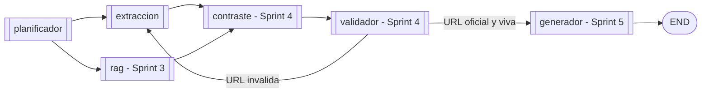

# Arquitectura - Sprint 2

Documento de entrega del **Sprint 2** del Agente de Transparencia
Electoral (ATE). Describe el agente de extraccion, los clientes contra
APIs oficiales, el nuevo flujo del grafo y mapea cada criterio de
aceptacion del sprint a la evidencia concreta en el codigo.

**Referencias cruzadas**

| Recurso | Archivo |
| :-- | :-- |
| Especificacion del sprint | `sprintRecomendaciones.md` § "SPRINT 2" |
| Sprint 1 (base) | `docs/arquitectura_sprint1.md` |
| Vision y restricciones eticas | `README.md` |
| Guia paso a paso de ejecucion | `docs/guia_ejecucion.md` |

---

## 1. Alcance

**Ejecutable en Sprint 2**

- Agente de extraccion (`src/ate/agents/extraccion.py`) que orquesta las
  tools del plan, captura excepciones y empaqueta resultados en un
  `ContextoExtraido` Pydantic estable.
- 4 tools reales contra APIs oficiales:
  - `consultar_datos_abiertos` -> Socrata `iaeu-rcn6` (Procuraduria SIRI).
  - `consultar_secop` -> Socrata SECOP I (`f789-7hwg`) + SECOP II (`jbjy-vk9h`).
  - `consultar_cne` -> Socrata configurable o CSV directo (Cuentas Claras).
  - `buscar_noticias` -> Tavily o Serper (despacho por env var).
- 1 tool stub que respeta el nuevo schema:
  - `buscar_plan_gobierno` -> declara `estado="no_configurado"` hasta Sprint 3.
- Cliente HTTP compartido (`src/ate/tools/_http.py`) con clasificacion
  estable de errores (`red`, `http`, `parseo`, `offline`) y header
  Socrata `X-App-Token` automatico cuando se configura.
- Schema `ResultadoExtraccion` + `ContextoExtraido` (Pydantic) con
  campo `urls_oficiales` ya disponible para citacion del Sprint 5.
- Modo `ATE_OFFLINE=1` que cortocircuita TODA llamada HTTP y devuelve
  `estado="offline"` con URL canonica conservada para trazabilidad.
- 79 tests pytest (38 de Sprint 1 + 41 nuevos de Sprint 2), todos
  deterministas, sin red ni API keys reales.

**Declarado pero no implementado** (hooks comentados para sprints 3-5)

- Agente RAG sobre planes de gobierno -> Sprint 3.
- Agente de contraste propuesta-vs-hechos -> Sprint 4.
- Agente validador de URLs / fuentes oficiales -> Sprint 4.
- Agente generador con citacion obligatoria -> Sprint 5.
- Interfaz Streamlit / FastAPI -> Sprint 5.

---

## 2. Topologia del grafo

### 2.1 Grafo Sprint 2


`extraccion` se ejecuta SIEMPRE despues de `planificador`. Si la
intencion es `INDEFINIDA` o el plan no tiene tools, el extractor
produce un `ContextoExtraido` vacio sin invocar ningun backend — esto
mantiene el grafo lineal y evita un edge condicional. Se introducira
el primer edge condicional en Sprint 4 (ciclo validador -> extraccion).

### 2.2 Grafo objetivo (sprints 3-5)



---

## 3. Estado compartido

`EstadoGrafo` ahora incluye `contexto_extraido`:

```python
class EstadoGrafo(TypedDict, total=False):
    pregunta: str
    plan: Optional[PlanEjecucion]
    contexto_extraido: Optional[ContextoExtraido]   # <-- Sprint 2

    # Hooks para sprints futuros (no poblar todavia):
    # contexto_rag, contraste, validacion, respuesta_final
```

`ContextoExtraido` agrega:

```python
class ContextoExtraido(BaseModel):
    consulta: str
    tools_invocadas: List[str]
    tools_omitidas: List[str]
    resultados: List[ResultadoExtraccion]
```

`ResultadoExtraccion` es el shape canonico que cada tool devuelve:

```python
class ResultadoExtraccion(BaseModel):
    fuente: str
    tool: str
    consulta: str
    estado: Literal["ok", "sin_datos", "no_configurado",
                    "error_red", "error_http", "error_parseo", "offline"]
    resultados: List[dict]
    total_resultados: int
    urls_oficiales: List[str]   # <- listo para validador (Sprint 4)
    mensaje: str
    error: Optional[str]
```

---

## 4. Agente de extraccion

### 4.1 Responsabilidades

1. Leer `pregunta` y `plan` del estado.
2. Invocar cada tool de `plan.tools` con la pregunta como consulta y
   las settings activas.
3. Capturar excepciones inesperadas y traducirlas a
   `estado="error_red"`.
4. Retornar `{"contexto_extraido": ContextoExtraido(...)}`.

### 4.2 Lo que NO hace el extractor (separacion explicita)

- **No clasifica.** El planificador ya decidio. Si el plan llega
  vacio, no se invoca nada.
- **No valida URLs.** Eso es responsabilidad del validador (Sprint 4).
- **No interpreta.** Solo pasa los resultados crudos al estado.
- **No inventa.** Las tools devuelven `sin_datos` o `no_configurado`
  cuando no hay informacion; el extractor respeta ese contrato.

### 4.3 Tolerancia a fallos (defense-in-depth)

| Capa | Que captura | Salida |
| :-- | :-- | :-- |
| `_http.py` | timeout, conexion, HTTP 4xx/5xx, JSON invalido | `HttpError(clase=...)` |
| Tool individual | `HttpError`, fuente vacia, dataset no configurado | `ResultadoExtraccion(estado=...)` |
| `_invocar_tool` | excepciones no controladas (bug) | `ResultadoExtraccion(estado="error_red")` |
| `extraer` | tool no registrada | `ResultadoExtraccion(estado="error_parseo")` |

Ningun fallo de tool tumba el grafo. La trazabilidad se conserva en el
campo `error` del resultado.

---

## 5. Tools reales

### 5.1 datos.gov.co (`consultar_datos_abiertos`)

- **Endpoint:** `https://{SOCRATA_DOMAIN}/resource/{ATE_SANCIONES_DATASET}.json`
- **Default dataset:** `iaeu-rcn6` (Procuraduria - Antecedentes SIRI).
- **Parametros:** `$q=<consulta>` (full-text), `$limit=ATE_MAX_RESULTADOS`.
- **Auth:** opcional `X-App-Token` (sube rate limit a 1000 req/h).
- **URL de citacion:** `https://www.datos.gov.co/d/iaeu-rcn6`.

### 5.2 SECOP (`consultar_secop`)

- **Datasets:** SECOP II (`jbjy-vk9h`) + SECOP I (`f789-7hwg`).
- **Estrategia:** consulta ambos con la misma `$q`, concatena
  resultados anotando `__sub_fuente__` en cada fila.
- **Tolerancia parcial:** si solo SECOP II falla, se devuelven los
  resultados de SECOP I y el mensaje incluye "Errores parciales: ...".

### 5.3 CNE - Cuentas Claras (`consultar_cne`)

Cuentas Claras no tiene API documentada, pero la SPA del fondo CNG 2026
expone endpoints REST que se pueden consultar sin credencial. La tool
soporta **tres modos**, en orden de prioridad:

1. `ATE_CNE_DATASET=<id_socrata>`: si el CNE publica un dataset Socrata
   en datos.gov.co para la eleccion 2026, ponerlo aqui (prioridad alta).
2. `ATE_CNE_CSV_URL=<url>`: URL directa a un CSV; el cliente lo
   descarga, parsea y filtra en memoria.
3. `ATE_CNE_USE_API=1` (**default**): cliente contra la API publica de la SPA del fondo CNG 2026
   (`app_cng_2026.cne.gov.co`). Endpoints usados:
     - `GET /getProcesosElectoralesPublic` — procesos electorales 2026
     - `GET /consultar/selecOganizacionPoliticaPublic` — organizaciones politicas
     - `GET /getTipoEleccionPublic` — tipos de eleccion
     - `GET /getCorporacionPublic/{tipo}/{proceso}` — corporaciones
     - `PUT /candidatos/getcandidatos` — candidatos por filtros (con CSRF)
     - `POST /consultar/informePublico` — ingresos/gastos del candidato (con CSRF)

   El cliente (`src/ate/tools/_cne_api.py`) maneja CSRF Laravel: hace
   un GET inicial a `/informes/cne` para recibir las cookies
   `XSRF-TOKEN` y `cne_session`, decodifica el token URL-encoded y lo
   inyecta como header `X-XSRF-TOKEN` en posteriores POST/PUT.

   **Limitacion conocida:** la SPA no expone busqueda libre por nombre
   de candidato. La estrategia del cliente para queries en lenguaje
   natural es:
     - Match por substring contra nombres de **organizacion politica**
       (ej. "Pacto Historico" -> id=28).
     - Si no hay match, devolver la lista de **procesos electorales 2026**
       como contexto disponible (no inventa datos).
     - Para detalle de un candidato individual, el caller debe navegar
       la jerarquia con IDs (proceso/tipo/corp/circ/dept/mun/org/cand).

Si los tres modos fallan, la tool devuelve `estado="no_configurado"`.
**Nunca inventa datos.**

### 5.4 Buscador de noticias (`buscar_noticias`)

| Backend | Endpoint | Auth | Activacion |
| :-- | :-- | :-- | :-- |
| Tavily | `POST https://api.tavily.com/search` | `TAVILY_API_KEY` | `ATE_NEWS_PROVIDER=tavily` |
| Serper | `POST https://google.serper.dev/news` | `X-API-KEY: SERPER_API_KEY` | `ATE_NEWS_PROVIDER=serper` |
| Ninguno | n/a | n/a | `ATE_NEWS_PROVIDER=none` |

Ambos normalizan resultados a `{titulo, url, snippet, publicado, ...}`.
Las URLs se exportan en `urls_oficiales` para citacion del Sprint 5.

---

## 6. Mapeo de criterios de aceptacion vs evidencia

Tomados literal de `sprintRecomendaciones.md` § "SPRINT 2 — Criterios
de aceptacion":

| Criterio | Evidencia |
| :-- | :-- |
| "El sistema consulta datos reales" | Smoke test verificable: `python -m ate "Que contratos tiene Petro en SECOP?"` con `ATE_OFFLINE=0` devuelve 50 contratos reales (25 SECOP I + 25 SECOP II) extraidos de `https://www.datos.gov.co/resource/jbjy-vk9h.json` y `https://www.datos.gov.co/resource/f789-7hwg.json`. |
| "Devuelve informacion estructurada" | Schema Pydantic `ResultadoExtraccion` (ver `src/ate/schemas/state.py`); validado por 79 tests; cobertura del shape en `tests/test_tools.py::test_cada_tool_devuelve_resultado_extraccion` (5 casos). |
| "Maneja errores correctamente" | Mapeo `HttpError -> EstadoResultado` en `src/ate/tools/_http.py::estado_desde_error`; defense-in-depth en `src/ate/agents/extraccion.py::_invocar_tool`; tests `tests/test_tools_apis.py::test_*_error_*` (8 casos) y `tests/test_extraccion.py::test_extractor_traduce_excepcion_a_error_red`. |

Entregables declarativos del sprint:

| Entregable | Ubicacion |
| :-- | :-- |
| Tools funcionales contra APIs oficiales | `src/ate/tools/{datos_abiertos,secop,cne,busqueda_noticias}.py` + helper `_socrata.py` + `_http.py` |
| Agente de extraccion conectado a APIs | `src/ate/agents/extraccion.py` (cubierto por 9 tests directos + 3 end-to-end via grafo) |
| Normalizacion de respuestas | `ResultadoExtraccion` y `ContextoExtraido` en `src/ate/schemas/state.py` |
| Manejo de errores | Clase `HttpError` + `estado_desde_error` + tests con HTTP mockeado |
| Integracion en LangGraph | `src/ate/graph/builder.py`: edge `planificador -> extraccion -> END` |

---

## 7. Flujo end-to-end (online vs offline)

### 7.1 Modo online

```
$ python -m ate --resumen "Que contratos tiene Petro en SECOP?"
{
  "pregunta": "Que contratos tiene Petro en SECOP?",
  "plan": {"intencion": "contratacion", "tools": ["consultar_secop"], ...},
  "contexto_extraido": {
    "consulta": "Que contratos tiene Petro en SECOP?",
    "tools_invocadas": ["consultar_secop"],
    "tools_omitidas": [],
    "resultados": [{
      "tool": "consultar_secop",
      "fuente": "SECOP I + SECOP II",
      "estado": "ok",
      "total_resultados": 50,
      "urls_oficiales": [
        "https://www.datos.gov.co/d/jbjy-vk9h",
        "https://www.datos.gov.co/d/f789-7hwg"
      ],
      "mensaje": "SECOP devolvio 50 contratos (25 en II, 25 en I) para 'Que contratos tiene Petro en SECOP?'."
    }]
  }
}
```

### 7.2 Modo offline (`ATE_OFFLINE=1`)

```
{
  ...
  "estado": "offline",
  "mensaje": "ATE_OFFLINE=1: SECOP no consultado.",
  "urls_oficiales": ["https://www.datos.gov.co/d/jbjy-vk9h"]
}
```

Las URLs canonicas se conservan incluso en offline — son metadatos del
dataset, no resultados de la consulta.

---

## 8. Restricciones eticas heredadas

| Restriccion | Como Sprint 2 la respeta |
| :-- | :-- |
| **Sin juicios de valor** | Las tools devuelven filas crudas de Socrata; no hay LLM en el extractor. La pregunta del usuario se reusa como `$q` sin reescritura ni opinion. |
| **Citacion obligatoria** | Cada `ResultadoExtraccion.urls_oficiales` lleva la URL canonica del dataset/articulo. El validador del Sprint 4 las verificara antes de que el generador del Sprint 5 las cite. |
| **Declarar ausencia explicitamente** | `estado="sin_datos"` (la fuente respondio sin matches), `estado="no_configurado"` (no hay credencial/dataset), `estado="offline"` (red deshabilitada). En NINGUN caso se inventa un resultado. Este contrato esta cubierto por `test_datos_abiertos_sin_datos`, `test_cne_no_configurado_por_defecto`, `test_noticias_no_configurado_sin_key`. |
| **Trazabilidad** | `ResultadoExtraccion.tool` (que tool produjo) + `consulta` (con que termino) + `urls_oficiales` (cita) + `error` (si fallo). El generador podra reconstruir cada respuesta desde estos campos. |
| **Separacion de responsabilidades** | Planificador clasifica; extractor invoca; ninguno toma decisiones del otro. Verificable en `src/ate/agents/extraccion.py::extraer` (no llama al LLM, no clasifica). |

---

## 9. Configuracion (variables de entorno nuevas)

| Variable | Default | Para que sirve |
| :-- | :-- | :-- |
| `ATE_OFFLINE` | `0` | `1` corta toda llamada HTTP. |
| `ATE_HTTP_TIMEOUT` | `20` | Timeout por llamada en segundos. |
| `ATE_MAX_RESULTADOS` | `25` | Limite Socrata por dataset. |
| `SOCRATA_DOMAIN` | `www.datos.gov.co` | Por si en el futuro se separa SECOP a otro Socrata. |
| `SOCRATA_APP_TOKEN` | (vacio) | Sube rate limit anonimo de Socrata. |
| `ATE_SECOP_II_DATASET` | `jbjy-vk9h` | ID Socrata de SECOP II. |
| `ATE_SECOP_I_DATASET` | `f789-7hwg` | ID Socrata de SECOP I. |
| `ATE_SANCIONES_DATASET` | `iaeu-rcn6` | ID Socrata de antecedentes SIRI. |
| `ATE_CNE_DATASET` | (vacio) | ID Socrata de Cuentas Claras (prioridad sobre API). |
| `ATE_CNE_CSV_URL` | (vacio) | URL directa a CSV de CNE (prioridad sobre API). |
| `ATE_CNE_USE_API` | `1` | Activa el cliente contra la API publica de la SPA CNE 2026. |
| `ATE_NEWS_PROVIDER` | `tavily` | `tavily \| serper \| none`. |
| `TAVILY_API_KEY` | (vacio) | Requerida si provider=tavily. |
| `SERPER_API_KEY` | (vacio) | Requerida si provider=serper. |
| `ATE_EXTRACCION_MAX_TOOLS` | `5` | Limite de tools por plan. |

Ver `.env.example` para la plantilla completa.

---

## 10. Verificacion del entregable

```powershell
# Suite completa (79 tests, deterministas, sin red) - debe pasar en ~3s
pytest

# Demo CLI offline (no consume APIs)
$env:ATE_OFFLINE="1"
python -m ate --resumen "Sanciones disciplinarias del candidato"

# Demo CLI online (consume APIs publicas, ~5s)
$env:ATE_OFFLINE="0"
python -m ate --resumen "Que contratos tiene Petro en SECOP?"
python -m ate --resumen "Antecedentes disciplinarios de Hernandez"

# Verificar el shape Pydantic crudo (no resumido)
python -m ate "Donantes de campana"
```

---

## 11. Matriz implementado vs pendiente

| Componente | Estado | Sprint |
| :-- | :-- | :-- |
| Grafo planificador -> extraccion -> END | **Implementado** | 2 |
| Agente de extraccion con manejo de errores | **Implementado** | 2 |
| Tool `consultar_datos_abiertos` (Socrata) | **Implementado** | 2 |
| Tool `consultar_secop` (Socrata, SECOP I + II) | **Implementado** | 2 |
| Tool `consultar_cne` (Socrata o CSV configurable) | **Implementado (opt-in)** | 2 |
| Tool `buscar_noticias` (Tavily o Serper) | **Implementado (opt-in)** | 2 |
| Cliente HTTP comun con HttpError tipado | **Implementado** | 2 |
| Modo `ATE_OFFLINE=1` para auditoria del flujo | **Implementado** | 2 |
| Schema `ResultadoExtraccion`/`ContextoExtraido` | **Implementado** | 2 |
| Suite pytest 79 casos sin red | **Implementado** | 2 |
| CLI con flags `--solo-plan` / `--resumen` | **Implementado** | 2 |
| Tool `buscar_plan_gobierno` real (RAG) | Pendiente | 3 |
| Agente RAG (ingesta PDFs + ChromaDB/Pinecone) | Pendiente | 3 |
| Agente de contraste propuesta-vs-hechos | Pendiente | 4 |
| Agente validador de URLs / fuentes oficiales | Pendiente | 4 |
| Edge condicional `validador -> extraccion` (ciclo) | Pendiente | 4 |
| Agente generador con citacion obligatoria | Pendiente | 5 |
| Interfaz Streamlit / FastAPI | Pendiente | 5 |
