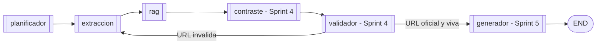

# Arquitectura - Sprint 3

Documento de entrega del **Sprint 3** del Agente de Transparencia
Electoral (ATE). Cubre dos cosas que llegaron juntas en este sprint:

1. **Sprint 2.5 (refinamiento)** — registro de candidatos 2026 +
   reescritura de consulta por tool. El planificador detecta al
   candidato y el extractor envia a cada API la forma que mejor
   indexa esa fuente.
2. **Sprint 3 (RAG)** — ingesta de los PDFs en `public/Candidatos/`,
   base vectorial Chroma persistente, agente RAG cableado al grafo y
   tool `buscar_plan_gobierno` real con filtro por candidato.

**Referencias cruzadas**

| Recurso | Archivo |
| :-- | :-- |
| Especificacion del sprint | `sprintRecomendaciones.md` § "SPRINT 3" |
| Sprint 2 (base) | `docs/arquitectura_sprint2.md` |
| Vision y restricciones eticas | `README.md` |
| Guia paso a paso de ejecucion | `docs/guia_ejecucion.md` |

---

## 1. Alcance

**Ejecutable en Sprint 3**

- Registro Pydantic con los **13 candidatos presidenciales 2026**
  inscritos (`src/ate/candidatos/registro.py`), construido a partir
  de los PDFs en `public/Candidatos/`.
- Detector deterministico de candidatos por substring/alias
  normalizado (`detectar_candidato`), invocado por el planificador.
- `PlanEjecucion` ahora lleva `candidato: Optional[Candidato]`.
- El extractor reescribe la consulta por tool segun el candidato:
    - `consultar_secop`         -> nombre canonico
    - `consultar_datos_abiertos`-> nombre canonico
    - `consultar_cne`           -> partido / movimiento
    - `buscar_noticias`         -> nombre + partido
- **Modulo RAG** (`src/ate/rag/`):
    - `cliente.py` — wrapper sobre `chromadb.PersistentClient` con
      filtro por `candidato_id` y embedding default ONNX (`all-MiniLM-L6-v2`).
    - `ingestor.py` — pipeline pypdf -> chunks (800/120) -> upsert.
    - Idempotente: re-ingerir un candidato sustituye sus chunks.
- **Agente RAG** (`src/ate/agents/rag.py`) cableado al grafo
  inmediatamente despues de la extraccion.
- Tool `buscar_plan_gobierno` real con filtro por candidato.
- Schemas Pydantic `PasajeRag` / `ContextoRag` con campos para
  citacion del Sprint 5 (pdf, pagina, score, chunk_id).
- Script CLI `scripts/ingestar_planes.py` con flags `--solo`,
  `--reset`, `--rag-dir`.
- Suite pytest con **135 casos** (47 nuevos sobre Sprint 2):
  candidatos, query rewriting, RAG client/agent/tool, ingestor,
  parsing PDF.

**Declarado pero no implementado**

- Agente de contraste propuesta-vs-hechos -> Sprint 4.
- Agente validador de URLs / fuentes oficiales -> Sprint 4.
- Agente generador con citacion obligatoria -> Sprint 5.
- Interfaz Streamlit / FastAPI -> Sprint 5.

---

## 2. Topologia del grafo

### 2.1 Grafo Sprint 3


`planificador` ahora detecta el candidato. `extraccion` reescribe la
consulta por tool. `rag` decide internamente si vale la pena consultar
la base vectorial:

- Si `intencion == PLAN_GOBIERNO` -> consulta.
- Si `intencion != PLAN_GOBIERNO` pero hay candidato detectado -> consulta
  igual (el plan del candidato puede aportar contexto a preguntas
  sobre contratacion / sanciones / etc.).
- Si nada de lo anterior -> retorna `ContextoRag(estado="sin_datos")`
  sin pegarle a Chroma.

### 2.2 Grafo objetivo (sprints 4-5)



---

## 3. Modelo de candidato

```python
class Candidato(BaseModel):
    id: str                        # slug kebab-case ("ivan-cepeda")
    nombre_canonico: str           # "Ivan Cepeda Castro"
    nombre_corto: str              # "Ivan Cepeda"
    alias: List[str]               # ["cepeda castro", "ivan cepeda", ...]
    partido: str                   # "Pacto Historico"
    posicion_tarjeton: int         # 1
    plan_pdf: str                  # "public/Candidatos/...Ivan Cepeda.pdf"
    cne_organizacion_id: int|None  # 28 (verificado en API CNE 2026)
```

Las propiedades `consulta_secop`, `consulta_cne`, `consulta_noticias`
encapsulan la forma optima por backend, evitando que el extractor
tenga conocimiento de cada fuente.

### 3.1 Catalogo 2026

| # | ID | Nombre canonico | Partido / Movimiento |
| :- | :- | :- | :- |
| 1 | `ivan-cepeda` | Ivan Cepeda Castro | Pacto Historico |
| 3 | `claudia-lopez` | Claudia Nayibe Lopez Hernandez | Movimiento Imparables |
| 4 | `raul-botero` | Raul Santiago Botero Jaramillo | Colombia Pa' Lante Unida |
| 5 | `abelardo-de-la-espriella` | Abelardo Gabriel de la Espriella Otero | Defensores de la Patria - Salvacion Nacional |
| 6 | `oscar-lizcano` | Oscar Mauricio Lizcano Arango | Colombianisimo - ASI |
| 7 | `miguel-uribe-londono` | Miguel Uribe Londono | Partido Democrata Colombiano |
| 8 | `sondra-garvin` | Sondra Macollins Garvin Pinto | Movimiento Sondra Presidente |
| 9 | `roy-barreras` | Roy Leonardo Barreras Montealegre | Agrupacion La Fuerza |
| 10 | `carlos-caicedo` | Carlos Eduardo Caicedo Omar | Fuerza Ciudadana |
| 11 | `gustavo-matamoros` | Gustavo Matamoros Camacho | Partido Ecologista Colombiano |
| 12 | `paloma-valencia` | Paloma Susana Valencia Laserna | Centro Democratico |
| 13 | `sergio-fajardo` | Sergio Fajardo Valderrama | Dignidad y Compromiso |
| 14 | `luis-gilberto-murillo` | Luis Gilberto Murillo Urrutia | Colombia Renaciente |

### 3.2 Reglas de alias

Para evitar falsos positivos:

- "Uribe" solo NO matchea a Miguel Uribe Londono (conflicto con
  Alvaro Uribe Velez, no candidato).
- "Valencia" solo NO matchea a Paloma Valencia (apellido demasiado comun).
- "Lopez" solo NO matchea a Claudia Lopez (apellido demasiado comun).
- En todos esos casos, los alias requieren al menos primer nombre +
  apellido para activarse.

---

## 4. RAG: pipeline de ingesta

```
PDFs en public/Candidatos/
        |
        v
pypdf.extract_text() por pagina
        |
        v
_limpiar_texto: junta lineas, repara palabras cortadas con guion
        |
        v
_ventanas: chunks de 800 chars con overlap 120
        |
        v
ChromaDB.upsert con metadata:
    candidato_id   = "ivan-cepeda"
    candidato_nombre = "Ivan Cepeda Castro"
    pdf            = path absoluto
    pagina         = N (1-based)
chunk_id = "ivan-cepeda:p3:c2"  (idempotente)
```

**Metadata por chunk** (la usa el generador del Sprint 5 para citar):

```python
{
    "candidato_id": "ivan-cepeda",
    "candidato_nombre": "Ivan Cepeda Castro",
    "pdf": "C:\\...\\candidatos_presidenciales_2026-Ivan Cepeda.pdf",
    "pagina": 3,
}
```

**Embeddings**: la `DefaultEmbeddingFunction` de Chroma usa el modelo
`all-MiniLM-L6-v2` via ONNX (~80MB). Se baja una vez del bucket
publico de Chroma y queda en `~/.cache/chroma/onnx_models/`. Despues
todo es offline. No requiere GPU.

### 4.1 Resumen de ingesta verificado

```
$ python scripts/ingestar_planes.py
CANDIDATO                                CHUNKS
--------------------------------------------------
ivan-cepeda                              13
claudia-lopez                            7
raul-botero                              4
abelardo-de-la-espriella                 13
oscar-lizcano                            4
miguel-uribe-londono                     4
sondra-garvin                            3
roy-barreras                             5
carlos-caicedo                           3
gustavo-matamoros                        3
paloma-valencia                          10
sergio-fajardo                           5
luis-gilberto-murillo                    4
Total en coleccion: 78 chunks.
```

### 4.2 Reingesta / actualizacion

`ingestar_candidato` borra los chunks previos del mismo `candidato_id`
antes de cargar los nuevos. Esto hace que correr el script dos veces
no duplique datos. Para reset total:

```powershell
python scripts/ingestar_planes.py --reset
```

---

## 5. Agente RAG

### 5.1 Decision logic

`consultar_rag(pregunta, plan, settings) -> ContextoRag`:

| Condicion | Resultado |
| :-- | :-- |
| `plan` es None o `INDEFINIDA` sin candidato | `estado=sin_datos`, no toca Chroma |
| `ate_offline=True` | `estado=offline`, no toca Chroma |
| chromadb no instalado | `estado=no_configurado` |
| Coleccion vacia | `estado=no_configurado`, indica reingestar |
| Error abriendo Chroma | `estado=error_red` |
| Sin hits | `estado=sin_datos` con mensaje claro |
| Hits | `estado=ok`, lista de `PasajeRag` |

### 5.2 Filtro por candidato

Cuando `plan.candidato` esta presente, el agente envia
`where={"candidato_id": "<slug>"}` a Chroma. La busqueda se restringe
a los chunks de ese candidato. Esto es lo que diferencia "¿que propone
Ivan Cepeda?" (filtra a Cepeda) de "¿que candidato propone X tema?"
(busca en toda la coleccion).

---

## 6. Reescritura de consulta por tool

| Tool | Sin candidato | Con candidato (Ivan Cepeda) |
| :-- | :-- | :-- |
| `consultar_secop` | pregunta cruda | `Ivan Cepeda Castro` |
| `consultar_datos_abiertos` | pregunta cruda | `Ivan Cepeda Castro` |
| `consultar_cne` | pregunta cruda | `Pacto Historico` |
| `buscar_noticias` | pregunta cruda | `Ivan Cepeda Pacto Historico` |
| `buscar_plan_gobierno` | (delegado al agente RAG) | (delegado al agente RAG) |

La tool `buscar_plan_gobierno` esta en `_TOOLS_DELEGADAS` del
extractor: el extractor NO la invoca. La consulta semantica la hace
el agente RAG en su nodo dedicado, que SI tiene acceso a la pregunta
original (no reescrita) — apropiado para busqueda semantica.

---

## 7. Mapeo de criterios de aceptacion vs evidencia

Tomados literal de `sprintRecomendaciones.md` § "SPRINT 3 — Criterios
de aceptacion":

| Criterio | Evidencia |
| :-- | :-- |
| "El sistema responde usando documentos" | `python -m ate "¿Que propone Ivan Cepeda sobre derechos humanos?"` con `ATE_OFFLINE=0` y la base ingestada devuelve 5 pasajes reales del PDF de Cepeda con score, pagina y URL canonica al PDF. Verificable en `tests/test_rag.py::test_rag_retorna_pasajes_normalizados`. |
| "Encuentra informacion relevante" | El score de Chroma (distancia coseno) ordena los pasajes por relevancia. Tests fixtures con datos sinteticos y la corrida real sobre 78 chunks confirman la ordenacion. |
| "Usa busqueda semantica" | Embeddings `all-MiniLM-L6-v2` ONNX + `cosine` distance en Chroma. Verificable en el corrida real: la consulta "derechos humanos" matchea pasajes que NO contienen literalmente esas palabras pero hablan del tema. |

Entregables declarativos del sprint:

| Entregable | Ubicacion |
| :-- | :-- |
| Base vectorial funcional | `data/rag/chroma/` (78 chunks ingeridos verificado) |
| Agente RAG funcionando | `src/ate/agents/rag.py` (cubierto por 11 tests) |
| Tool real `buscar_plan_gobierno` | `src/ate/tools/rag_planes.py` |
| Ingestor + script CLI | `src/ate/rag/ingestor.py` + `scripts/ingestar_planes.py` |
| Schemas Pydantic | `PasajeRag`, `ContextoRag` en `src/ate/schemas/state.py` |
| Integracion en grafo | `src/ate/graph/builder.py` — edge `extraccion -> rag -> END` |

---

## 8. Configuracion (variables nuevas)

| Variable | Default | Para que sirve |
| :-- | :-- | :-- |
| `ATE_RAG_DIR` | `data/rag` | Directorio raiz de persistencia ChromaDB. |
| `ATE_RAG_TOP_K` | `5` | Cuantos pasajes recuperar por consulta. |
| `ATE_RAG_CHUNK_SIZE` | `800` | Tamano de chunk en caracteres (ingestor). |
| `ATE_RAG_CHUNK_OVERLAP` | `120` | Solapamiento entre chunks. |

---

## 9. Verificacion del entregable

```powershell
# 0. Suite completa (135 tests, deterministas, sin red) - debe pasar en ~3s
pytest

# 1. Ingesta de los 13 PDFs (primer run baja ~80MB de modelo)
python scripts/ingestar_planes.py

# 2. Demo CLI con candidato detectado + RAG
$env:ATE_OFFLINE="0"
python -m ate --resumen "¿Que propone Ivan Cepeda sobre derechos humanos?"
python -m ate --resumen "Plan de gobierno de Sergio Fajardo en educacion"
python -m ate --resumen "¿Que dice Paloma Valencia sobre seguridad?"

# 3. Demo CLI sin candidato — busqueda global en la coleccion
python -m ate --resumen "transicion energetica"

# 4. Reingestar un solo candidato (idempotente)
python scripts/ingestar_planes.py --solo paloma-valencia --reset
```

---

## 10. Restricciones eticas heredadas

| Restriccion | Como Sprint 3 la respeta |
| :-- | :-- |
| **Sin juicios de valor** | El agente RAG solo recupera pasajes; no resume ni opina. El generador del Sprint 5 sera responsable de presentar los pasajes con citacion sin reformular. |
| **Citacion obligatoria** | Cada `PasajeRag` lleva `pdf` (path), `pagina` y `chunk_id`. El generador del Sprint 5 podra construir citas como "(Plan de Gobierno de Ivan Cepeda Castro, p. 3)". |
| **Declarar ausencia explicitamente** | Si la base esta vacia -> `no_configurado` con instrucciones de reingestar. Si no hay hits para la pregunta -> `sin_datos` con mensaje claro. NUNCA se inventa una propuesta. |
| **Trazabilidad** | `chunk_id` (`<candidato_id>:p<pagina>:c<idx>`) permite reconstruir exactamente que fragmento del PDF vio el agente. |
| **Separacion de responsabilidades** | El RAG es un nodo dedicado en el grafo. El extractor lo declara como tool delegada (`_TOOLS_DELEGADAS`) y NO lo invoca: el RAG corre en su nodo, con su propia logica de filtrado. |

---

## 11. Matriz implementado vs pendiente

| Componente | Estado | Sprint |
| :-- | :-- | :-- |
| Registro Pydantic 13 candidatos 2026 | **Implementado** | 2.5 |
| Detector candidato deterministico | **Implementado** | 2.5 |
| `PlanEjecucion.candidato` | **Implementado** | 2.5 |
| Reescritura consulta por tool | **Implementado** | 2.5 |
| Cliente ChromaDB persistente | **Implementado** | 3 |
| Ingestor PDFs (pypdf + chunks) | **Implementado** | 3 |
| Script CLI ingestar_planes.py | **Implementado** | 3 |
| Agente RAG con filtro por candidato | **Implementado** | 3 |
| Tool `buscar_plan_gobierno` real | **Implementado** | 3 |
| Schemas `PasajeRag` / `ContextoRag` | **Implementado** | 3 |
| Edge `extraccion -> rag -> END` | **Implementado** | 3 |
| Suite pytest 135 casos sin red | **Implementado** | 3 |
| Agente de contraste propuesta-vs-hechos | Pendiente | 4 |
| Agente validador de URLs / fuentes oficiales | Pendiente | 4 |
| Edge condicional `validador -> extraccion` (ciclo) | Pendiente | 4 |
| Agente generador con citacion obligatoria | Pendiente | 5 |
| Interfaz Streamlit / FastAPI | Pendiente | 5 |
