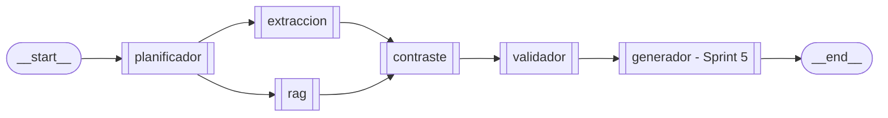

# Arquitectura - Sprint 4

Documento de entrega del **Sprint 4** del Agente de Transparencia
Electoral (ATE): **Contraste y Validación**. Cierra el objetivo de
"cruzar información y validar veracidad".

**Referencias cruzadas**

| Recurso | Archivo |
| :-- | :-- |
| Especificacion del sprint | `sprintRecomendaciones.md` § "SPRINT 4" |
| Sprint 3 (base RAG) | `docs/arquitectura_sprint3.md` |
| Sprint 5 (generador + interfaz) | `docs/arquitectura_sprint5.md` |
| Vision y restricciones eticas | `README.md` |

---

## 1. Alcance

**Ejecutable en Sprint 4**

- **Agente de contraste** (`src/ate/agents/contraste.py`): cruza las
  propuestas del plan de gobierno (`ContextoRag`) con los datos reales
  de las fuentes oficiales (`ContextoExtraido`) usando cuatro reglas
  deterministicas. 100% sin LLM → reproducible y sin alucinaciones.
- **Agente validador** (`src/ate/agents/validador.py`): verifica que
  las URLs citadas por las tools pertenezcan a dominios oficiales
  colombianos (`*.gov.co` + lista explicita) y, en modo online, que
  sean accesibles via HTTP HEAD.
- Schemas Pydantic nuevos en `src/ate/schemas/state.py`:
  `InconsistenciaPropuesta`, `ContextoContraste`, `ValidacionFuente`,
  `ContextoValidacion`.
- Integracion en el grafo: `contraste` (fan-in de extraccion + rag) y
  `validador` se cablean entre el RAG y el generador.
- Suite pytest: `tests/test_contraste.py` (30+ casos) y
  `tests/test_validador.py` (30+ casos), todos offline y deterministas.

---

## 2. Topologia del grafo

`extraccion` y `rag` abren en abanico desde el planificador y corren en
paralelo (escriben claves distintas del estado). `contraste` hace
**fan-in**: espera a que ambos terminen. No hay fast-path: todos los
nodos corren siempre para preservar la cadena de evidencia completa.

---

## 3. Agente de contraste

### 3.1 Reglas deterministicas

| Regla | Condicion | Inconsistencia |
| :-- | :-- | :-- |
| 1. `propuesta_sin_contratos` | Hay propuestas RAG + SECOP fue consultado + 0 contratos | El candidato propone pero no hay contratos asociados |
| 2. `contratos_sin_propuesta` | Hay contratos SECOP + 0 propuestas RAG | Hay contratos pero el plan no se encontro |
| 3. `sanciones_detectadas` | La Procuraduria SIRI registra sanciones | Sanciones disciplinarias del candidato |
| 4. `inconsistencia_sectorial` | Propuestas y contratos presentes, pero el sector de la propuesta no aparece en los contratos | Brecha sectorial propuesta vs. gasto |

Los sectores (salud, educacion, infraestructura, vivienda, seguridad,
medio_ambiente, tecnologia, agricultura, energia, justicia) se detectan
por keyword matching sobre el texto (ver `_SECTORES`).

### 3.2 Control de alucinaciones

- **Sin candidato → `estado="sin_candidato"`**: cruzar propuestas contra
  contratos de "cualquiera" no tiene valor; se requiere identidad.
- **Sin datos → `estado="sin_datos"`**: si no hay propuestas, contratos
  ni sanciones, se declara la ausencia.
- Cada `InconsistenciaPropuesta` lleva `evidencia_propuesta` y
  `evidencia_dato` con **fragmentos literales** de los datos. Nunca se
  sintetiza ni se infiere mas alla de lo que los datos dicen.

---

## 4. Agente validador

### 4.1 Reglas de dominio oficial

- Cualquier hostname que termine en `.gov.co` (o `gov.co` exacto) es
  oficial — cubre todos los ministerios y entidades del estado.
- Lista explicita adicional (`_DOMINIOS_OFICIALES_EXACTOS`) para casos
  con TLD distinto, p.ej. `rnec.org.co`.

### 4.2 Modo online vs. offline

| Modo | Validacion de dominio | Accesibilidad (HTTP HEAD) | `accesible` |
| :-- | :-- | :-- | :-- |
| `ATE_OFFLINE=1` | si | no (no toca red) | `None` |
| online | si | si (HEAD con `allow_redirects`) | `True`/`False` |

Deduplica URLs (varias tools pueden citar la misma) y nunca propaga
excepciones de red al grafo: un HEAD fallido se traduce a
`accesible=False` con la razon en `observacion`.

---

## 5. Mapeo de criterios de aceptacion vs evidencia

Tomados de `sprintRecomendaciones.md` § "SPRINT 4 — Criterios de aceptacion":

| Criterio | Evidencia |
| :-- | :-- |
| "El sistema cruza informacion" | `contrastar()` combina `ContextoRag` + `ContextoExtraido`. Verificable en `tests/test_contraste.py`. |
| "Detecta inconsistencias" | Cuatro reglas deterministicas producen `InconsistenciaPropuesta` con evidencia literal. |
| "No inventa datos" | Sin candidato → `sin_candidato`; sin datos → `sin_datos`. Sin LLM en el contraste. |
| "Declara ausencia de informacion" | Estados explicitos `sin_datos`/`sin_candidato`/`sin_fuentes` y mensajes accionables. |

---

## 6. Matriz implementado vs pendiente

| Componente | Estado | Sprint |
| :-- | :-- | :-- |
| Agente de contraste (4 reglas) | **Implementado** | 4 |
| Schemas contraste/validacion | **Implementado** | 4 |
| Agente validador de dominios | **Implementado** | 4 |
| Validacion de accesibilidad (HEAD) | **Implementado** | 4 |
| Fan-in extraccion+rag → contraste | **Implementado** | 4 |
| Tests contraste + validador | **Implementado** | 4 |
| Agente generador + citacion | **Implementado** | 5 |
| Interfaz Streamlit | **Implementado** | 5 |
