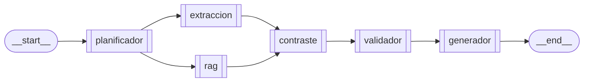

# Arquitectura - Sprint 5

Documento de entrega del **Sprint 5** del Agente de Transparencia
Electoral (ATE): **Agente Generador + Interfaz + Producto Final**. Cierra
el sistema multiagente de 6 agentes orquestados por LangGraph.

**Referencias cruzadas**

| Recurso | Archivo |
| :-- | :-- |
| Especificacion del sprint | `sprintRecomendaciones.md` § "SPRINT 5" |
| Sprint 4 (contraste + validador) | `docs/arquitectura_sprint4.md` |
| Vision y restricciones eticas | `README.md` |
| Guia paso a paso de ejecucion | `docs/guia_ejecucion.md` |

---

## 1. Alcance

**Ejecutable en Sprint 5**

- **Agente generador** (`src/ate/agents/generador.py`): sintetiza la
  respuesta final a partir de toda la evidencia recolectada
  (extraccion, RAG, contraste, validacion).
    - **Camino LLM (opt-in)**: Anthropic (`langchain-anthropic`) u
      Ollama local, segun `ATE_LLM_PROVIDER`.
    - **Camino determinista (default y fallback)**: construye una
      respuesta en un solo parrafo sin LLM. Es el que usan los tests y
      el que se activa cuando no hay credencial o el LLM falla.
- **Citacion obligatoria**: el generador anexa las URLs oficiales
  **validadas** (`_citas_oficiales`) y cita los pasajes del plan como
  `[Plan de Gobierno, pág N]`.
- **Interfaz Streamlit** (`app.py`): chat web que invoca el grafo y
  muestra la respuesta final + una **cadena de evidencia auditable**
  (plan, contraste, RAG, extraccion, validacion).
- **CLI** (`python -m ate`) extendido: emite `respuesta_final` ademas
  del plan, contexto extraido, RAG, contraste y validacion.
- Suite pytest: `tests/test_generador.py` y `tests/test_e2e_sprint5.py`
  (flujo completo, ausencia de datos, neutralidad, todos-los-nodos,
  citacion obligatoria).

---

## 2. Topologia final del grafo



Los 6 agentes especializados, orquestados como una maquina de estados
LangGraph. `extraccion` y `rag` corren en paralelo; `contraste` hace
fan-in. **Todos los nodos corren siempre** (no hay fast-path): incluso
una pregunta indefinida deja la cadena de evidencia completa en el
estado final, preservando la trazabilidad.

---

## 3. Agente generador

### 3.1 Decision de modo

```
generar(pregunta, estado, settings, meta)
    |
    +-- cfg.llm_available?  --(si)--> intenta LLM (anthropic / ollama)
    |                                      |
    |                                      +-- exito --> respuesta LLM
    |                                      +-- excepcion --> fallback
    |
    +-- (no) ------------------------------------------> fallback determinista
```

`meta` (expuesto como `llm_info` en el estado) registra
`llm_available`, `llm_provider`, `used_fallback`, `llm_error` y
`llm_error_type` para trazabilidad/diagnostico.

### 3.2 Citacion obligatoria

`_citas_oficiales(estado)` recopila las URLs a citar:

1. Prioriza `ContextoValidacion.fuentes_validadas` con `es_oficial=True`
   (ya pasaron por el validador del Sprint 4).
2. Si no hay validacion, cae a las `urls_oficiales` crudas del contexto
   extraido.
3. Deduplica preservando orden. Si no hay URLs, devuelve `[]` (no
   inventa fuentes).

El fallback anexa `Fuentes oficiales: <url1>, <url2>.` al final de la
respuesta y los pasajes del plan se citan inline como
`[Plan de Gobierno, pág N]`.

### 3.3 Control de alucinaciones

- El prompt del LLM prohibe juicios de valor y exige basarse solo en la
  evidencia provista.
- El fallback nunca afirma datos que no esten en el estado; si no hay
  evidencia declara explicitamente "no se ha encontrado evidencia
  oficial suficiente".

---

## 4. Interfaz Streamlit (`app.py`)

| Caracteristica | Detalle |
| :-- | :-- |
| Chat | `st.chat_input` + historial en `st.session_state` |
| Grafo cacheado | `@st.cache_resource` compila el grafo una vez por sesion |
| Auto-ingesta RAG | Si la base esta vacia y NO es offline, ingiere los PDFs al arrancar |
| Cadena de evidencia | Expanders: plan, contraste, RAG, extraccion, validacion |
| Citacion visible | Muestra URLs oficiales con enlaces y el badge de validacion |
| Sidebar | Configuracion activa (red, LLM) + lista de candidatos 2026 |

Ejecutar:

```powershell
pip install -e ".[ui]"
streamlit run app.py
```

---

## 5. Mapeo de criterios de aceptacion vs evidencia

Tomados de `sprintRecomendaciones.md` § "SPRINT 5 — Criterios de aceptacion":

| Criterio | Evidencia |
| :-- | :-- |
| "Respuestas claras y verificables" | El generador produce un parrafo + la cadena de evidencia es navegable en la UI. |
| "Cita fuentes oficiales" | `_citas_oficiales` + validador del Sprint 4. `tests/test_generador.py::TestCitacionObligatoria`. |
| "Flujo completo funcional" | Grafo de 6 nodos compilado; `tests/test_e2e_sprint5.py` recorre el ciclo completo. |
| "No hay alucinaciones" | Fallback determinista + prohibicion de juicios; `test_e2e_neutrality_check`, `test_e2e_no_data_found`. |

Entregables declarativos del sprint:

| Entregable | Ubicacion |
| :-- | :-- |
| Sistema multiagente completo | `src/ate/graph/builder.py` (6 nodos) |
| Interfaz funcional | `app.py` (Streamlit) |
| Respuestas con fuentes citadas | `src/ate/agents/generador.py` |
| Documentacion | `docs/arquitectura_sprint{4,5}.md`, `README.md`, `CLAUDE.md` |

---

## 6. Restricciones eticas — como Sprint 5 las respeta

| Restriccion | Mecanismo |
| :-- | :-- |
| **Sin juicios de valor** | Prompt lo prohibe; fallback no opina; test de neutralidad. |
| **Citacion obligatoria** | `_citas_oficiales` anexa URLs validadas; pasajes citan pagina. |
| **Validacion de enlaces** | El validador (Sprint 4) filtra por dominio oficial antes de citar. |
| **Declarar ausencia** | Fallback declara ausencia; estados `sin_datos`/`offline`/`no_configurado`. |
| **Trazabilidad** | `llm_info` + cadena de evidencia completa en el estado y en la UI. |

---

## 7. Configuracion (variables relevantes)

| Variable | Default | Para que sirve |
| :-- | :-- | :-- |
| `ATE_LLM_PROVIDER` | `none` | `anthropic`, `ollama`, `openai` o `none` (fallback determinista). |
| `ANTHROPIC_API_KEY` | — | Credencial para el camino LLM Anthropic. |
| `ATE_ANTHROPIC_MODEL` | `claude-sonnet-4-6` | Modelo Anthropic. |
| `OLLAMA_HOST` / `OLLAMA_MODEL` | `http://127.0.0.1:11434` / `llama3.2:3b` | Camino LLM local. |
| `ATE_OFFLINE` | `false` | Corta toda la red (tools, validador, auto-ingesta). |
